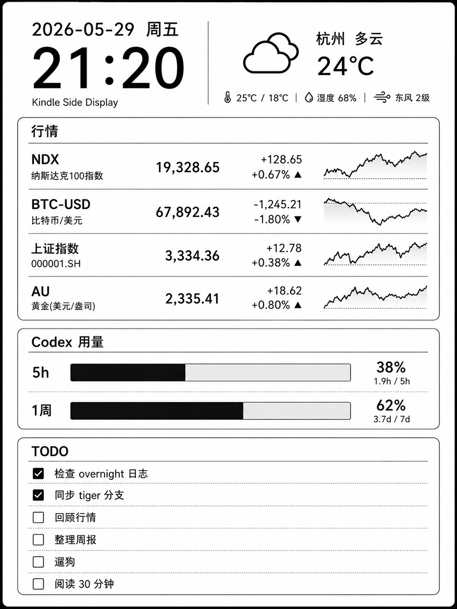

# kindle-dash-gen

**English** | [简体中文](README.zh-CN.md)

Generate a Kindle-friendly dashboard PNG and serve it at `/dash.png`.

The generated image is:

- `1080x1440`
- 8-bit grayscale PNG
- No alpha channel
- English-only text, with non-ASCII names sanitized before rendering

## Samples

Both samples are the actual `1080x1440` grayscale PNGs sent to the Kindle. The landscape output is
pre-rotated so it reads correctly when the Kindle is held sideways.

| Portrait | Landscape |
| :---: | :---: |
|  |  |
| `output.orientation: portrait` | `output.orientation: landscape` |

## Setup

```powershell
python -m venv .venv
.\.venv\Scripts\Activate.ps1
pip install -r requirements.txt
Copy-Item config.example.yaml config.yaml
```

Edit `config.yaml` before running:

- `market.symbols`: yfinance symbols to display. Use `PRIMARY(FALLBACK)` (for example `^NDX(NQ=F)`) to show the primary while its market is open and switch to the fallback once it closes; the closed primary's price and change are then shown on a second line.
- `weather.location`: city name, or set `latitude` and `longitude`
- `codex.token`: ChatGPT bearer token for Codex usage
- `schedule.cron`: render schedule, for example `*/15 * * * *`
- `cache.data_path`: local data snapshot used when a later fetch fails

Do not commit a real `codex.token`. Keep it in local `config.yaml`; `config.example.yaml` must stay as a placeholder.

## Generate Once

```powershell
python dash.py --once
```

This writes `dash.png` or the path configured in `output.path`.

## Run Server

```powershell
python dash.py --serve
```

The server returns the existing image from disk and refreshes it in the background using `schedule.cron`.
HTTP requests to `/dash.png` only return the already generated file, so the Kindle does not wait for market,
weather, or Codex reads.

The default URL is:

```text
http://<your-lan-ip>:5678/dash.png
```

For example:

```text
http://192.168.31.115:5678/dash.png
```

Open the settings and live preview page at:

```text
http://<your-lan-ip>:5678/settings
```

The page edits every runtime setting (output, data sources, schedule, server, and Codex token) and saves the
complete configuration atomically to `config.yaml`. The live preview reloads the existing `dash.png` every
60 seconds without triggering data fetches or image generation. Landscape Kindle output is automatically
rotated back to a browser-friendly 1440x1080 preview. A clock appears beside `5H` in both
portrait and landscape dashboards when the token expires within 24 hours or is already expired. The settings
page exposes a credential, so keep the server on a trusted LAN and do not publish it to the internet.

`/dash.png` reads `config.yaml` only to locate `output.path`, then returns that existing PNG. If it has not
been generated yet, run `python dash.py --once` first.

## Data Behavior

- Market data uses `yfinance`.
- Market quotes are rendered as text in two columns, up to 16 symbols.
- Weather uses Open-Meteo and does not require an API key.
- Codex usage calls `https://chatgpt.com/backend-api/wham/usage` with `codex.token`.
- If Codex returns `used_percent: 1` and `reset_after_seconds` equals `limit_window_seconds`, the primary window is displayed as `0% not started`.

Before rendering, the app writes the merged dashboard data to `cache.data_path`. Later failures reuse the last successful data where possible, so the endpoint still returns a valid PNG with the most recent usable values.
