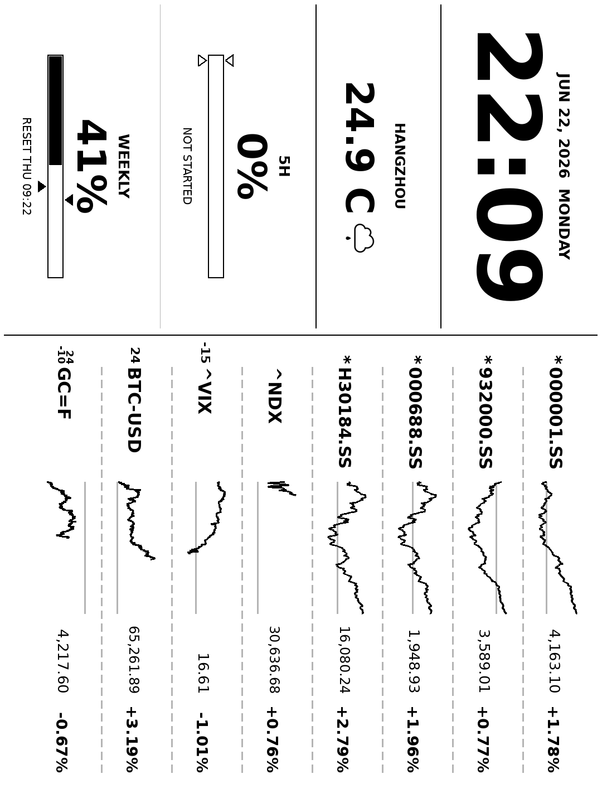

# kindle-dash-gen

[English](README.md) | **简体中文**

生成适配 Kindle 的仪表盘 PNG，并通过 `/dash.png` 提供访问。

生成的图片为：

- `1080x1440`
- 8 位灰度 PNG
- 无 alpha 通道
- 仅英文文本，渲染前会对非 ASCII 名称做净化处理

## 样例

下方的横屏仪表盘预览已逆时针旋转 90°，便于在屏幕上正向阅读。发送到 Kindle 的实际输出仍为预先旋转的 `1080x1440` 灰度 PNG。

<p align="center">
  
</p>

在 Kindle 端，你可以使用 [pascalw/kindle-dash](https://github.com/pascalw/kindle-dash) 自动拉取并显示生成的 `/dash.png`。

## 安装

```powershell
python -m venv .venv
.\.venv\Scripts\Activate.ps1
pip install -r requirements.txt
Copy-Item config.example.yaml config.yaml
```

运行前编辑 `config.yaml`：

- `market.symbols`：要显示的 yfinance 或自定义代码。使用 `PRIMARY(FALLBACK)`（例如 `^NDX(NQ=F)`）可在主市场开盘时显示主代码，收盘后切换到备用代码；此时已收盘的主代码价格与涨跌幅会显示在第二行。
- `market.custom_symbols`：按显示代码配置自定义接口。接口的最新 `Exposure` 显示为仓位百分比，`Return` 显示为涨跌幅并按分钟绘制盘中曲线；缺失分钟由相邻点直线连接。请求显式忽略系统代理。若当天无数据，会按 `lookback_days` 逐日前溯。
- `weather.location`：城市名，或设置 `latitude` 与 `longitude`
- `codex.token`：用于 Codex 用量查询的 ChatGPT bearer token
- `schedule.cron`：渲染计划，例如 `*/15 * * * *`
- `cache.data_path`：在后续抓取失败时使用的本地数据快照

不要提交真实的 `codex.token`。请将其保存在本地的 `config.yaml` 中；`config.example.yaml` 必须保持为占位符。

## 单次生成

```powershell
python dash.py --once
```

会写入 `dash.png`，或写入 `output.path` 中配置的路径。

## 运行服务

```powershell
python dash.py --serve
```

服务会从磁盘返回已存在的图片，并在后台按 `schedule.cron` 刷新。对 `/dash.png` 的 HTTP 请求只返回已生成的文件，因此 Kindle 不会等待行情、天气或 Codex 的读取。

默认 URL 为：

```text
http://<your-lan-ip>:5678/dash.png
```

例如：

```text
http://192.168.31.115:5678/dash.png
```

在以下地址打开设置与实时预览页面：

```text
http://<your-lan-ip>:5678/settings
```

该页面可编辑全部运行时设置（输出、数据源、计划、服务器以及 Codex token），并将完整配置原子化保存到 `config.yaml`。实时预览每 60 秒重新加载已存在的 `dash.png`，不会触发数据抓取或图片生成。横屏 Kindle 输出会自动旋转回浏览器友好的 1440x1080 预览。当 token 将在 24 小时内过期或已过期时，竖屏与横屏仪表盘都会在 `5H` 旁出现一个时钟图标。设置页面会暴露凭据，请将服务器保持在可信局域网内，不要发布到公网。

`/dash.png` 仅读取 `config.yaml` 以定位 `output.path`，随后返回该已存在的 PNG。如果尚未生成，请先运行 `python dash.py --once`。

## 数据行为

- 行情数据默认使用 `yfinance`，`market.custom_symbols` 中的代码使用对应自定义接口。
- 行情报价以文本形式分两列渲染，最多 16 个代码。
- 天气使用 Open-Meteo，无需 API key。
- Codex 用量调用 `https://chatgpt.com/backend-api/wham/usage`，并附带 `codex.token`。
- 如果 Codex 返回 `used_percent: 1` 且 `reset_after_seconds` 等于 `limit_window_seconds`，主窗口将显示为 `0% not started`。
- 渲染前，应用会将合并后的仪表盘数据写入 `cache.data_path`。后续失败时会尽可能复用上一次成功的数据，因此接口仍能返回带有最近可用数值的有效 PNG。
